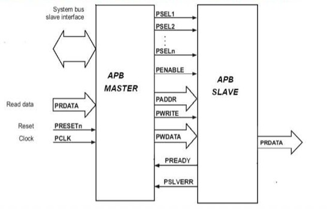
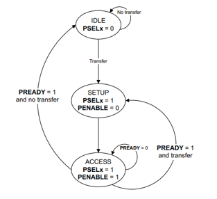
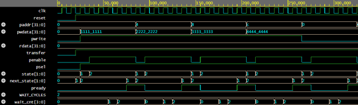

# APB Protocol Using Verilog

## Overview

This project presents the design and implementation of the Advanced Peripheral Bus (APB) Protocol using Verilog HDL.

APB (Advanced Peripheral Bus) is a low-power, low-complexity bus protocol within the ARM AMBA architecture, primarily used for communication with low-bandwidth peripherals such as UART, SPI, I2C, GPIO, Timers, and Interrupt Controllers.

The implemented design consists of an APB Master and APB Slave communicating through standard APB control, address, and data signals. The design supports memory-mapped read and write operations, wait-state generation using PREADY, error handling using PSLVERR, and back-to-back transfers for continuous communication.


---

## Features

- APB Master Design
- APB Slave Design
- Memory-Mapped Read/Write Operations
- Wait-State Generation Using PREADY
- Error Handling Using PSLVERR
- Back-to-Back Transfers
- Internal Memory Implementation
- FSM-Based Control Logic
- Parameterized Address Width (32-bit)
- Parameterized Data Width (32-bit)
- Comprehensive Testbench Verification

---

## Introduction to APB

The Advanced Peripheral Bus (APB) is designed for low-power and low-bandwidth peripherals.

### Key Characteristics

- Simple Bus Architecture
- Non-Pipelined Communication
- Low Hardware Complexity
- Low Power Consumption
- Memory-Mapped Communication
- Wait-State Support
- Error Handling Support

---

## System Architecture

The APB communication system consists of an APB Master and APB Slave connected through standard APB signals.

The APB Master initiates transactions by generating address, control, and data signals. The APB Slave receives these requests, performs memory operations, and generates response signals including PREADY and PSLVERR.

The communication follows the standard APB protocol phases:

- IDLE
- SETUP
- ACCESS



---

## APB Signal Interface

| Signal | Direction | Description |
|----------|----------|-------------|
| PCLK | Global | APB Clock |
| PRESETn | Global | Active-Low Reset |
| PADDR | Master → Slave | Address Bus |
| PSEL | Master → Slave | Slave Select |
| PENABLE | Master → Slave | Access Enable |
| PWRITE | Master → Slave | Read/Write Control |
| PWDATA | Master → Slave | Write Data Bus |
| PRDATA | Slave → Master | Read Data Bus |
| PREADY | Slave → Master | Transfer Completion Signal |
| PSLVERR | Slave → Master | Error Indication Signal |

### Design Parameters

```text
ADDR_WIDTH = 32
DATA_WIDTH = 32
```

---


## Finite State Machine (FSM)

The APB protocol is implemented using a three-state FSM.

### FSM States

### IDLE

- Default bus state
- No transfer active
- PSEL = 0

### SETUP

- Transfer preparation state
- Address and control become valid
- PSEL = 1
- PENABLE = 0

### ACCESS

- Data transfer state
- PENABLE = 1
- Wait-state support through PREADY

### State Transition Logic

```text
IDLE → SETUP → ACCESS

ACCESS → IDLE
ACCESS → SETUP (Back-to-Back Transfer)
ACCESS → ACCESS (Wait State)
```



---

## Wait-State Implementation

In practical systems, slower peripherals may require additional processing time.

To support such devices, the APB Slave generates wait states using the PREADY signal.

### Features

- Configurable Wait Counter
- Stable Address During Wait State
- Stable Data During Wait State
- Master Remains in ACCESS State

---

## Simulation Results

### Wait-State Generation and Back-to-Back Transfer




## Applications

- UART Peripheral Interface
- SPI Peripheral Interface
- I2C Peripheral Interface
- GPIO Controllers
- Timer Modules
- Embedded Systems
- FPGA-Based Designs
- System-on-Chip (SoC) Designs

---

## Advantages

- Simple Bus Architecture
- Low Power Consumption
- Easy to Implement
- Supports Wait States
- Supports Error Handling
- Efficient Peripheral Communication

---

## Limitations

- No Burst Transfers
- No Pipelining
- Single Transfer at a Time
- Lower Performance Than AHB
- Lower Performance Than AXI

---

## Project Report


Detailed report available in the report folder.

---

## Author

**Nensi Thummar**

Electronics and Communication Engineering

Nirma University

---

## References

1. ARM AMBA APB Protocol Specification
2. Samir Palnitkar – Verilog HDL: A Guide to Digital Design and Synthesis
3. M. Morris Mano – Digital Design
4. ARM AMBA Architecture Documentation
5. APB Protocol Technical Reference Manual
